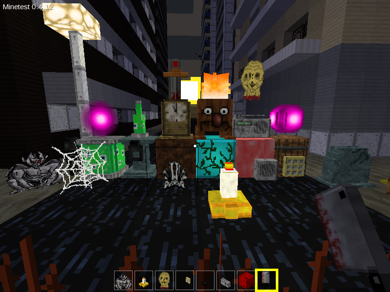

# horror

Minetest mod that adds horror themed blocks, materials, mobs and other assets.

# Settings

All settings are false by default:

* **horror.sounds** enable sporadic sounds
* **horror.weird_stuff** enable weird stuff
* **horror.override_flint_and_steel** override flint and steel
* **horror.dark** dark setting
* **horror.dark_dark** even darker setting
* **horror.place_sam_head_on_death** override default death

# Attributions

See: `license.txt`
